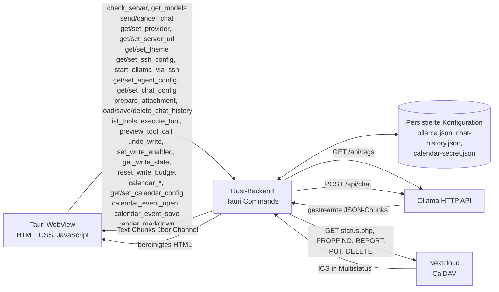

# Architektur

Wie Mimir aufgebaut ist: welche Teile es gibt, wie eine Nachricht durchläuft und wo
was im Quelltext liegt.

Zum Nachschlagen, nicht zum Erlernen. Wer Mimir benutzen will, braucht nichts
davon – dafür ist [../README.md](../README.md) da.



Die Liste im Kasten ist eine Auswahl; vollständig ist sie in `invoke_handler` (`src-tauri/src/lib.rs`).

Der Weg über den Kalender führt bewusst am Modell vorbei: Die Oberfläche holt die Termine selbst, das Modell bekommt sie nur, wenn im Chat danach gefragt wird.

## Kalender

`src-tauri/src/calendar.rs` hält Einstellungen, URL-Prüfung, Zertifikatsentscheidung, die Ablage des gespeicherten App-Passworts und den Sitzungszustand. `calendar/client.rs` spricht CalDAV, liest die Multistatus-Antworten und erfragt das Zertifikat. `calendar/events.rs` macht aus ICS die Anzeige, inklusive Wiederholungen und Zeitzonen. Für alle Kalenderbausteine liegen Tests daneben: `calendar/tests.rs` und `calendar/*/tests.rs`.

Bewusst ohne CalDAV- und ohne ICS-Bibliothek: CalDAV ist `PROPFIND` und `REPORT`, also zwei DAV-Arten, und die ICS-Aufbereitung ist der Teil, der ohnehin eigene Tests verdient. Dazu gekommen sind `quick-xml` für die Antworten, `chrono` und `chrono-tz` für die Zeitrechnung sowie `rustls` und `sha2` für HTTPS mit selbstsigniertem Zertifikat.

## Frontend

Das Frontend liegt vollständig in `src/` und benötigt keinen JavaScript-Build-Schritt.

- `src/index.html` enthält die statische Benutzeroberfläche.
- `src/styles.css` definiert das Elflord-Farbschema, die Chat-Darstellung und die Markdown-Stile. Rahmenmaß, Eckenradius, Abstände und Innenabstände stehen als Variablen in `:root`, damit alle Bedienelemente gleich aussehen. Zwei Werte sind bewusst direkt am Bedienelement notiert: die Höhe der Eingabeleinzeile (48 px, weil `main.js` das Feld nach dem Senden auf genau diesen Wert zurücksetzt) und die kleineren Innenabstände der beiden Knopfreihen, die zweireihig sitzen. Die Farben stehen in genau zwei Blöcken: `:root` für das dunkle Schema und `[data-theme='hell']` für das helbe; jede andere Stelle liest nur die Variablen.
- `src/main.js` verwaltet Modelle, Slash-Befehle, Chat-Verlauf, Benutzereingaben und das Streaming.

Das Frontend verwendet die globale Tauri-Schnittstelle `window.__TAURI__`. Dadurch bleiben WebView und Rust-Backend klar voneinander getrennt, während die Kommunikation über typisierte Tauri-Commands und Channels erfolgt.

Beim Start setzt das Frontend den Fokus direkt auf das Eingabefeld, damit ohne Mausklick getippt werden kann. Da WebKitGTK den Fokus beim ersten Zeichnen des Fensters gern wieder auf das Dokument zurücksetzt, wird beim ersten Fokusieren des Fensters einmal nachgefasst. Hat der Benutzer bis dahin schon getippt, bleibt der Fokus unangetastet.

## Rust-Backend

Das Backend liegt in `src-tauri/` und übernimmt alle Netzwerkanfragen sowie die sichere Markdown-Aufbereitung.

- `src-tauri/src/main.rs` startet die Anwendung.
- `src-tauri/src/lib.rs` registriert die Tauri-Commands, verwaltet die persistente Ollama-Konfiguration und enthält die Ollama-Kommunikation.
- `src-tauri/src/calendar.rs` hält die Kalendereinstellungen, die Adressprüfung und den Sitzungszustand mit dem App-Passwort.
- `src-tauri/src/calendar/client.rs` spricht CalDAV und liest die Antworten als XML.
- `src-tauri/src/calendar/events.rs` macht aus ICS die Anzeige, inklusive Wiederholungen und Zeitzonen.
- `src-tauri/src/calendar/write.rs` plant Termine und baut die ICS-Datei, ohne den Server zu berühren. Dieselbe Planung liefert Vorschau und tatsächlichen Vorgang.
- `src-tauri/src/calendar/ics.rs` bearbeitet eine bestehende Termin-Datei: Zeilen entfalten, die genannten Eigenschaften setzen, den Rest unangetastet lassen.
- `src-tauri/src/calendar/edit.rs` plant das Ändern und Löschen und entscheidet, was abgelehnt wird: Serie, Teilnehmer, und beim Ändern eine `uid`, die nicht zum geladenen Termin passt.
- `src-tauri/src/calendar/tests.rs` und `src-tauri/src/calendar/*/tests.rs` prüfen die Zeitrechnung, die Adressprüfung und den Netzzugriff gegen einen nachgebauten Server.
- `src-tauri/tauri.conf.json` konfiguriert Tauri, das Hauptfenster und die statische Frontend-Auslieferung.
- `src-tauri/capabilities/default.json` definiert die Berechtigungen der WebView.
- `src-tauri/Cargo.toml` enthält die Rust-Abhängigkeiten.

## Gestaltung

Rahmen und Knöpfe folgen einer gemeinsamen Regel, damit die Anwendung an jeder Stelle gleich wirkt. Rahmenstärke, Eckenradius, Abstände, Innenabstände und die Farben stehen dafür als Variablen in `:root` am Anfang von `src/styles.css`; was früher je nach Ort anders kodiert war, hängt daran. Zwei Ausnahmen sind bewusst und mit Begründung direkt am Bedienelement notiert: die Höhe der Eingabeleinzeile (48 px, weil `main.js` das Feld nach dem Senden auf genau diesen Wert zurücksetzt) und die kleineren Innenabstände der Knopfreihen, die zweireihig sitzen.

Die Oberfläche gibt es in zwei Schemata, und beide sind vollständig über dieselben Variablen definiert: `:root` trägt das dunkle, `[data-theme='hell']` das helle. Das Attribut sitzt am `<html>`, weil die Farben für alles im Fenster gelten, auch für die Fenster, die währenddessen geöffnet werden; dunkel ist das, was ohne Attribut erscheint, damit eine alte Installation unverändert startet. Die Wahl steht als `theme` in `ollama.json` und wird über `get_theme` und `set_theme` gelesen und geschrieben. Der Umschalter oben links wechselt erst dann die Anzeige, wenn das Backend die Wahl bestätigt hat: Ein Schema anzuzeigen, das nicht gespeichert werden konnte, wäre eine Zusage ohne Deckung. Beim Start erscheint deshalb für einen Moment das dunkle Schema, bis das Backend geantwortet hat.

Ein Knopf hat immer einen Rahmen. Die Füllung unterscheidet nur die Bedeutung, nicht die Form: ausführend gefüllt (Senden, „Anmelden", „Verbinden", „Speichern", „Ausführen", „Schreiben", „Zertifikat bestätigen"), zurückhaltend mit Rahmen (Abbrechen, Umschalter im Ruhezustand), Rot nur für den SSH-Neustart und Bernstein für alles, was schreibt oder ändert (Schreibmodus, Schreibschritt, Unterschiedszusammenfassung). Fokus ist über die Tastatur sichtbar, und der Abstand zwischen Bedienelement und Text bleibt überall gleich.

Die Kalenderleiste nimmt 260 px am rechten Rand ein. Ihre drei Knöpfe teilen sich eine eigene Reihe unter der Überschrift „Kalender", weil sie in dieser Breite sonst umbrechen und die Leiste unruhig wirkt. Unter 720 px Fensterbreite startet die Leiste eingeklappt, damit die Unterhaltung nicht auf einen Rest reduziert wird; der Knopf **Kalender: an** im Kopf holt sie zurück. Die Entscheidung fällt nur beim Start: Ein späteres Verbreitern des Fensters holt die Leiste nicht von selbst zurück. Eingeklappt pausiert die automatische Aktualisierung, damit der Server im LAN nicht umsonst angesprochen wird – ein ausdrückliches `/termine` holt dagegen weiterhin Termine. Das Fenster startet deshalb mit 1080 px Breite.

## Datenfluss

### Modellliste

1. Beim Start ruft das Frontend `get_models` auf.
2. Das Backend fragt `GET /api/tags` beim Ollama-Server ab.
3. Die Modelle werden aus der Antwort gelesen, sortiert und dedupliziert. Höchstens 1000 Modelle und 1 MiB Antwort werden gelesen, mehr gilt als zu groß.
4. Das Frontend befüllt das Dropdown-Menü und aktiviert den Senden-Button. Eine bereits getroffene Wahl bleibt dabei erhalten, solange das Modell noch in der Liste steht; fehlt es, wird das erste Modell der Liste verwendet.
5. Beim Senden liest das Frontend den aktuell im Dropdown gewählten Wert und übergibt genau dieses Modell mit der Anfrage. Der Retry-Knopf im normalen Chat verwendet die dann aktuelle Auswahl; im Agentenmodus wiederholt er den Zug mit dem Modell, das beim Senden gewählt war.

### Provider

Es gibt zwei Providers, und sie beschaffen die Modelle auf zwei verschiedene Arten: `remote` nimmt die eingetragene `server_url` und spricht mit dem Ollama dahinter, `local` rechnet in der eingebauten Engine auf diesem Rechner. In der Kopfzeile heißen sie **Server** und **Lokal**; die Werte bleiben `remote` und `local`, damit die Konfigurationsdatei lesbar bleibt und nicht zwei Namen für dieselbe Sache entstehen. Die Wahl steht in `ollama.json` unter `provider` und fehlt dort in einer alten Konfiguration – dann gilt `remote`, sonst würde eine bestehende Installation beim Start auf den lokalen Rechner zeigen.

`OllamaSettings::get_base_url` ist die einzige Stelle, die die Adresse bestimmt, und sie gilt nur für `remote`. Jede Anfrage an ein Ollama läuft darüber: Modellliste, Chat, Statusprüfung, Warteprüfung vor einem Wiederholungsversuch und die Erreichbarkeitsprüfung vor dem SSH-Start. Es gibt bewusst keinen zweiten Weg, sonst läge eine der beiden Anfragen an der falschen Adresse.

`local` fragt keine Adresse ab, weil es keine gibt. `check_server` meldet dort „bereit“, `send_chat_message` ruft `chat_mit_engine` statt `send_chat_attempt`, und die Modellliste kommt aus `get_lokale_modelle` statt aus `/api/tags`. Für den Benutzer bleibt die Oberfläche dieselbe: derselbe Kopf, dieselbe Auswahl, dieselben Chunks auf demselben Kanal.

### Die eingebaute Engine

`engine.rs` bringt llama.cpp als Rust-Bindung mit (`llama-cpp-2`). Sie lädt das Modell aus Mimirs Modellordner, wendet die im GGUF mitgelieferte Chat-Vorlage an und erzeugt Token für Token über eine Stichprobenkette.

**Der entscheidende Entwurf: Die Engine bildet Ollamas Antwortform nach.** Der Werkzeugkreis, die Termine, das Zählen der Kontextbelegung, der Abbruch und die Oberfläche erwarten Newline-JSON mit `message.content` und `done`. Genau das erzeugt `engine.rs`. Deshalb liegt dort kein HTTP-Server und kein eigener Nachrichtenweg – der Rest der Anwendung wüsste sonst, dass es zwei Quellen für Token gibt, und es müsste sie unterscheiden.

Die Werkzeugschemata, die ein Ollama als Feld im Auftrag bekäme, gehen hier als Anweisung in die Systemnachricht; der Aufruf kommt als JSON-Rahmen im Text zurück und wird in `engine/werkzeug.rs` gelesen. Was nicht lesbar ist, bleibt Text und wird nicht ausgeführt.

Das Rechnen läuft in `spawn_blocking`, weil es den Rechner belegt und ein Thread aus dem Tokio-Vorrat währenddessen nichts anderes bedienen würde – auch nicht den Abbruch. Der Abbruch wird deshalb zwischen zwei Token geprüft, nicht über einen Kanal.

**Jedes Token geht sofort auf den Kanal.** `antwort()` nimmt einen Rückruf, der je
Token aufgerufen wird; die Kanalkopie geht in `spawn_blocking` mit und sendet von
dort. Das ist keine Bequemlichkeit: Auf einem Rechner ohne Grafik dauert ein Token
gut eine Zehntelsekunde und eine ganze Antwort damit eine halbe Minute. Kam sie
erst am Ende, stünde in dieser Zeit eine leere Blase im Fenster. Vorher das Laden
des Modells, jetzt der Zustand als Ereignis `engine-status`, und der Text
Stück für Stück.

`server_url` bleibt beim Wechsel unverändert und wird im lokalen Provider weder gelesen noch geschrieben: `set_base_url` lehnt dort ab und nennt den Weg zurück. Wer auf `remote` wechselt, arbeitet deshalb ohne erneutes Abtippen weiter.

Der Provider wirkt auf den Umfang: `wirksamer_umfang` gibt im lokalen Provider den Terminumfang heraus, unabhängig von dem, was in `agent.scope` steht. Das passiert an jeder Stelle, an der Werkzeuge angeboten (`list_tools`) oder eine Schreibfreigabe geprüft wird (`preview_tool_call`, `execute_tool`, `execute_calendar_change`), und nicht nur in der Anzeige. `get_agent_config` und `set_agent_config` geben deshalb den wirksamen Umfang zurück, und `set_agent_config` lehnt `Scope::Agent` lokal ab. Details in [Konfiguration](konfiguration.md#provider-woher-die-modelle-kommen).

### Serverstatus und SSH-Start

1. Beim Start und nach jeder manuellen Prüfung wird `GET /api/tags` mit einem Zeitlimit von **fünf Sekunden** aufgerufen. Das Laden der Modellliste ist ein eigener Aufruf und hat zehn Sekunden.
2. Die Kopfzeile zeigt `Online`, `Offline`, `instabel`, `Prüfe ...` oder während des SSH-Starts `SSH startet ...` an.
3. Wenn der Server offline ist, wird der Button `SSH starten` eingeblendet – im lokalen Provider nicht, denn hier gibt es keinen Server im Netz zu starten. Ebenso fehlt dann der Knopf **Adresse**; beide werden bei jeder Statusänderung neu bewertet.
4. Ist der Server bereits erreichbar, wird überhaupt keine SSH-Verbindung aufgebaut.
5. `start_ollama_via_ssh` versucht zuerst die Anmeldung mit dem eingestellten Schlüssel, den OpenSSH-Standardpfaden oder dem `ssh-agent` im nichtinteraktiven Modus. Es wird genau **eine** SSH-Verbindung pro Startversuch aufgebaut.
6. Meldet OpenSSH einen Authentifizierungsfehler, zeigt Mimir einen maskierten Passwortdialog. Host-Key-, Schlüssel- und Netzwerkfehler werden anhand des Exit-Codes und der Fehlermeldung getrennt und **nicht** als Passwortanforderung fehlinterpretiert.
7. Nach der Passworteingabe wird direkt der Passwortversuch gestartet. Es findet kein zweiter, zwangsläufig scheiternder Schlüsselversuch statt.
8. Das Passwort wird nur für den aktuellen Verbindungsversuch in einer kurzlebigen, geschützten Hilfsdatei gehalten, nicht in `ollama.json` oder im Chatverlauf gespeichert und anschließend überschrieben und gelöscht.
9. Auf dem Remote-System wird `ollama serve` nur gestartet, wenn noch kein `ollama`-Prozess läuft. Mimir startet es fest als

   ```sh
   OLLAMA_HOST="0.0.0.0" OLLAMA_ORIGINS="*" ollama serve
   ```

   Der Prozess wird mit `nohup` und umgeleiteter Ausgabe gestartet, überlebt also das Ende der SSH-Verbindung. `OLLAMA_HOST="0.0.0.0"` bindet auf alle Interfaces, damit der Server über die eingegebene Server-Adresse aus dem LAN erreichbar ist.

   Läuft bereits ein `ollama`, prüft Mimir zusätzlich, ob tatsächlich ein Listener auf `0.0.0.0:11434` liegt. Die Desktop-App lauscht standardmäßig nur auf `127.0.0.1` und wäre aus dem LAN nicht erreichbar; statt stillschweigend Erfolg zu melden, bricht Mimir dann mit einer Handlungsanweisung ab, weil ein zweiter Start am belegten Port scheitern würde.
10. Das Log liegt in `$HOME/.local/state/mimir/ollama.log`, ist nicht öffentlich und wird beim Start auf 10 MiB rotiert.
11. Mimir prüft nach dem Start bis zu 20 Sekunden lang, ob der Server erreichbar wird, und lädt anschließend die Modellliste.

### Chatnachricht

1. Das Frontend erstellt aus dem aktuellen Verlauf und der neuen User-Nachricht eine begrenzte Anfrage.
2. `send_chat_message` validiert Prompt, Rollen, Historiengröße und Gesamtbytes vor dem Netzwerkzugriff.
3. Die Anfrage wird per `POST /api/chat` mit aktiviertem Streaming gesendet; Redirects werden nicht verfolgt. Auf die Antwortköpfe wartet Mimir bis zu zwei Minuten: Bei lokaler Inferenz mit langem Prompt oder ausgelastetem Rechner braucht schon der erste Token deutlich länger (gemessen 2,6 s bei freier Maschine).
4. Verbindungsfehler werden nicht als englischer Rohtext weitergegeben, sondern mit einer Handlungsanweisung. Die Fälle werden getrennt, weil sie verschiedene Ursachen haben: Läuft unter der Adresse **kein Dienst**, verweist Mimir auf `/server-start`. Kam die **Verbindung nicht zustande** – etwa weil ein Funkloch den Verbindungsaufbau verschluckt –, nennt Mimir den Port, die möglichen Ursachen (Funklast, Firewall, ein nur lokal lauschendes Ollama mit `OLLAMA_HOST="0.0.0.0"`) und, wenn mehrere Versuche liefen, wie oft neu versucht wurde. Hat der Server die Anfrage **angenommen, aber nicht geantwortet**, ist es eine andere Meldung. Die technische Angabe bleibt als zweite Zeile erhalten.

   **Ein Client für alles.** Vorher wurde für jede Anfrage ein neuer HTTP-Client gebaut und damit jedes Mal neu verbunden. Auf einer Strecke, die schwankt, ist genau der Handshake der wacklige Teil – eine bereits bestehende Verbindung wäre sofort nutzbar gewesen. Jetzt teilen sich Chat, Statusanzeige und Modellliste einen Client mit Verbindungspool: bis zu vier offene Verbindungen, eine fünf Minuten lang ungenutzt im Pool. Die Zeitgrenzen sitzen an der einzelnen Anfrage statt am Client, damit ein Chat sich Zeit nehmen kann und eine Statusanzeige nicht.

   **Drei Zustände, nicht zwei.** Die Anzeige kennt zusätzlich zu „Online" und „Offline" ein **„instabel"**: Der Server hat vor Kurzem geantwortet, dieser eine Test ist aber ins Leere gelaufen. Rot wäre eine Lüge, und der angebotene Neustart schadet, weil er an einem Server vorbeigeht, der läuft. Erst wenn zwei Minuten lang nichts ankam, ist „Offline" eine brauchbare Aussage und der Neustart über SSH der richtige Rat. Mimir merkt sich deshalb den Zeitpunkt des letzten Kontakts – jede geladene Modelliste, jede erfolgreiche Statusprüfung und jede **vollständig zu Ende gelesene** Antwort zählen. Ein einzelner Token mitten im Strom genügt dafür nicht: Ein Strom, der danach abbricht, soll nicht als Kontakt gelten.

   **Die Modellliste wird nicht mehr vor der Anfrage geleert.** Das war der Grund für das Blockieren: Ein kurzer Aussetzer beim Laden ersetzte die Liste durch einen Platzhalter, sperrte die Auswahl und ließ nichts mehr senden – bis von Hand nachgeprüft wurde. Jetzt bleibt die vorhandene Liste stehen, bis neue Modelle ankommen; nur beim allerersten Laden, wo noch gar nichts da ist, wird sie ersetzt. Unterschieden wird streng: Ist der Abruf **gescheitert**, bleibt alles bedienbar und die Anzeige sagt „instabel". Hat der Server **geantwortet und keine Modelle**, wird die Auswahl gesperrt – eine alte Liste wäre dann irreführend. Und `/server-status` unterscheidet in der Meldung zwischen einem Ausfall („nicht erreichbar", mit Verweis auf `/server-start`) und einer Funkstelle („war vor *N* Sekunden noch da", mit *N* = tatsächlichem Alter).

   **Nach einem Fehlschlag versucht Mimir die Modellliste selbst erneut**, viermal im Abstand von vier Sekunden – aber nur solange noch keine brauchbare Liste steht. Gibt es eine, bleibt sie bedienbar und es wird gar nicht erneut versucht. Ohne die Wiederholung blieb die Anwendung nach einem einzigen Aussetzer für immer kaputt, bis von Hand geprüft wurde — auf einer schwankenden Strecke der Normalfall. Danach hört es auf, damit ein wirklich ausgefallener Server nicht endlos angesprochen wird. Und „instabel“ erscheint **nur mit Beleg**: Hat es in den letzten zwei Minuten Kontakt gegeben, gilt ein Aussetzer als Funkstelle; sonst ist es „Offline“ mit dem Neustasten. Eine erfundene Anzeige wäre hier besonders schädlich, weil sie zum falschen Handeln führt.

   **Die Statusanzeige wartet fünf Sekunden, die Modellliste zehn.** Drei waren zu knapp: Ist der Server gerade mit dem Laden oder Erzeugen beschäftigt, galt er sonst als ausgefallen. Und ein Fehlschlag beim Laden der Modellliste lässt das Fenster nicht mehr unbedienbar: Eine vorhandene Auswahl bleibt stehen und der Senden-Knopf wird nicht gesperrt.

   Der Verbindungsaufbau beim Chat darf 15 Sekunden dauern, die kleinen Prüfungen weiterhin nur 5. Grund ist eine Messung im WLAN zwischen Mimir und dem Server: 60 bis 265 ms Runtrip, zeitweise mit Verlust. Linux wiederholt einen Verbindungsaufbau nach 1, 2 und 4 Sekunden, ein Handshake braucht bei Funkstille also leicht länger als fünf Sekunden. Fünf Sekunden zu erzwingen hieß hier, einen verlorenen Handshake als ausgefallenen Server zu melden – die Meldung führte dann auf eine Firewall, während Rechner und Dienst längst wieder antworteten.
5. Das Backend liest den HTTP-Stream mit Daten-, Zeilen- und Blocklimits und sendet jedes Textfragment über einen Tauri-Channel an das Frontend. Denktext von Reasoning-Modellen kommt in einem eigenen Feld (`message.thinking`) an, je Nachricht auf 256 KiB gedeckelt, und wird als `StreamChunk` getrennt vom Antworttext übertragen.
6. Kommt fünf Minuten lang kein Token, prüft das Backend `/api/tags`; ist der Server erreichbar, beginnt die Wartezeit neu, bei zwei Fehlern in Folge wird abgebrochen. Nach 15 Minuten ohne jedes Token wird unabhängig vom Serverstatus abgebrochen. Der Abbruch-Button bleibt jederzeit verfügbar.
7. Während jeder Funkstille prüft das Backend zusätzlich einmal pro Minute den Serverstatus, aber erst nach einer vollen Minute Stille. Drei aufeinanderfolgende Fehlversuche gelten als unterbrochene Verbindung und beenden den laufenden Chat. Ein automatischer Neuversand kommt nur zustande, wenn noch kein einziger Token angekommen ist – nach Teildaten wäre ein Neustart des Zugs ein Verlust dessen, was schon da ist.
8. Reqwest setzt unter Linux standardmäßig `tcp_user_timeout = 30s` und `tcp_keepalive = 15s` mit drei Wiederholungen; der Kernel würde die Verbindung also nach etwa einer Minute abbrechen, noch bevor die Regeln oben greifen. Für alle Ollama-Clients deaktiviert Mimir das User-Timeout und verwendet großzügigere Keepalive-Werte (120 s / 15 s / 4 Versuche).
9. Das Frontend zeigt die Textfragmente zunächst laufend an; `cancel_chat` beendet eine laufende Anfrage.
10. Bricht die Verbindung ab, bevor der erste Token angekommen ist, und der Server per `/api/tags` erreichbar bleibt, wiederholt das Backend die Anfrage (maximal drei Versuche, Health-Check mit drei Anläufen im Abstand von fünf Sekunden). Das Frontend meldet jeden Neuversuch über das Tauri-Event `chat-retry`; abgebrochene Chats, HTTP-Fehler und die 15-Minuten-Grenze werden nicht wiederholt.
11. Nach Abschluss der Antwort wird der vollständige Text an `render_markdown` übergeben.
12. Das Backend erzeugt HTML mit `pulldown-cmark`, begrenzt die Eingabe und bereinigt das Ergebnis mit `ammonia`.
13. Das sichere HTML wird in der AI-Chat-Blase dargestellt; die History wird erst nach erfolgreicher Antwort committed. Bei Fehlern bleibt der bereits empfangene Text sichtbar und die Blase erhält einen Knopf für einen manuellen Neuversuch.

### Denktext von Reasoning-Modellen

Denkmodelle wie `gemma4` oder `qwen3.5` liefern ihren internen Denktext in jedem Stream-Chunk zusätzlich im Feld `message.thinking`. Mimir zeigt ihn oberhalb der Antwort in einem eigenen Block („Denkprozess"), dargestellt in gedämpfter Monospace-Schrift, damit er sich klar von der Antwort abhebt. Modelle ohne Reasoning liefern dieses Feld nicht; dann entsteht kein Block.

- Während der Denkphase ist der Block aufgeklappt, damit man dem Modell beim Denken zusehen kann. Sobald der erste Antworttext ankommt, klappt er sich selbst ein und rückt die Antwort in den Vordergrund.
- Der Block bleibt über den Umschalter jederzeit wieder aufklappbar; der Zustand steht in `aria-expanded`.
- Hat der Benutzer den Block während der Denkphase selbst bedient, bleibt seine Wahl maßgeblich: Der automatische Kollaps greift dann nicht und überschreibt nichts.
- Im Agentenmodus wird der Block je Modellanfrage neu aufgebaut: Nach jedem Werkzeugschritt verschwindet er samt der bis dahin gesammelten Denktext und steht wieder aufgeklappt da. Sichtbar bleibt am Ende nur der Denktext des letzten Schritts.
- Denktext zählt als Fortschritt: Während einer langen Denkphase läuft die Wartezeit-Regelung normal weiter, und die Ladeanzeige am unteren Chat-Rand bleibt sichtbar.
- Denktext wird **nicht** an Ollama zurückgeschickt. `without_thinking` entfernt ihn vor jedem Request, damit der Kontext einer Folgeanfrage nicht um ihn wächst.
- Der Block wird per `render_markdown` gerendert und damit genau wie die Antwort gegen unsicheres HTML und unsichere Links bereinigt.
- Der Denktext zählt nicht zur Historie: Für Folgeaufträge wird wie bisher nur der Antworttext gespeichert.

### Slash-Befehle

Eingaben, die mit `/` beginnen, werden nicht an Ollama gesendet, sondern lokal als Befehl interpretiert. `/help` zeigt die Befehle nach Themen gruppiert mit Befehl und Beschreibung in Spalten; die Übersicht ist zugleich die Quelle für die Verwendungshinweise bei fehlerhafter Eingabe (`COMMAND_HELP` in `src/main.js`).

**TAB ergänzt.** Im Eingabefeld ergänzt die Tabulator-Taste den angefangenen Befehl, nach einem Leerzeichen dessen Argument. Die Kandidaten stehen als Liste **über** der Eingabe, nicht im Chat – ein TAB ist keine Unterhaltung, und die Leiste soll beim Blättern nicht springen.

| Taste | Wirkung |
| --- | --- |
| TAB | setzt den ersten Kandidaten und öffnet die Liste, wenn es mehrere gibt |
| TAB | geht zum nächsten, am Ende wieder zum ersten |
| Umschalt+TAB | geht zurück; als **erste** Taste markiert es den letzten der Liste |
| ENTER | übernimmt den markierten Befehl ins Feld, **ohne** ihn zu senden |
| Esc | schließt die Liste |

Bei genau einem Treffer setzt TAB ihn und lässt die Liste zu – so bleibt der übliche Weg sauber. **Umschalt+TAB** wird dagegen immer verbraucht, auch bei einem einzigen Treffer und auch als erste Taste: Ein Tastendruck, der den Fokus aus dem Feld hinausschickt, während ein Befehl zur Verfügung steht, ist immer ein Fehler. Zurück von Anfang an heißt deshalb „der letzte", nicht „gar nichts".

TAB wird in der **Fangphase** auf `window` abgefangen, nicht am Feld selbst. Das ist keine Feinheit: Der Fokus wanderte beim Umschalt+TAB zum Knopf davor, obwohl `preventDefault` am Feld stand. Dass der Fokus wandert, heißt, dass der Tastendruck zugestellt wurde – nur nicht dort, wo er abgefangen wurde. In der Fangphase kommt er garantiert an. Zusätzlich holt ein `focusin` den Fokus zurück, falls er doch entkommt; solange keine Liste offen ist, greift das nicht und verhindert damit nicht, das Feld mit TAB zu verlassen.

**ENTER** nimmt den markierten Befehl ins Feld, damit ein halb fertiger Befehl nicht nur deshalb abgeschickt wird, weil der Benutzer ihn gerade ansehen wollte; ein zweites ENTER sendet dann.

Die Liste kommt aus derselben Tabelle wie `/help`, es gibt also keine zweite, die irgendwann nicht mehr stimmt. Ein Platzhalter wird nie vorgeschlagen: Nach `/context ` oder `/ssh-key ` bleibt TAB TAB, weil dort eine Zahl, ein Pfad oder eine Adresse erfunden werden müsste.

Was TAB bewusst nicht tut:

- Es wird nur verwendet, wenn die Eingabe mit `/` beginnt **und** es etwas zu ergänzen gibt – in beide Richtungen. Gibt es nichts zu ergänzen, bleibt die Taste, was sie sonst ist; dann ist der Fokuswechsel auch richtig, weil es nichts abzubrechen gab. Andernfalls würde ein Tastendruck den Fokus wegnehmen, ohne etwas getan zu haben.
- Ein Leerzeichen wird nur angehängt, wenn das ergänzte Wort ein fertiger Befehl ist. Nach `/agent-` stünde sonst ein Leerzeichen im Feld, das man wieder löschen müsste.
- Text hinter dem Cursor bleibt stehen, damit ein Ergänzen mitten im Text nichts löscht. Beim Blättern wird genau die Stelle ersetzt, die zuletzt eingesetzt wurde – die Position wird nicht aus dem Textinhalt neu erraten, sonst landete der Kandidat nach einer Änderung im Feld an der falschen Stelle.
- Jede Eingabe, ein Verlassen des Feldes und das Senden schließen die Liste.
- Es wird nichts vorgeschlagen, was nicht in `COMMAND_HELP` steht. Die Grammatik dafür ist absichtlich winzig und steht in den `usage`-Zeilen: `[aus|zertifikat]` sind Alternativen, `<pfad>` und `<token>` sind Platzhalter, und `|` trennt Alternativen nur außerhalb von Klammern.

- `/help` zeigt alle verfügbaren Befehle
- `/server-status` prüft die Erreichbarkeit und aktualisiert die Modellliste
- `/server-start` startet Ollama über das konfigurierte SSH-Ziel
- `/server-url` zeigt die aktuell konfigurierte Ollama-URL
- `/server-url <URL>` validiert und speichert eine neue Server-URL nach Benutzerbestätigung
- `/ssh-target` zeigt das konfigurierte SSH-Ziel und den eingestellten Schlüssel
- `/ssh-target <benutzer@host> [port]` setzt SSH-Benutzer, Host und optionalen Port nach Benutzerbestätigung; die Schlüsselvorgabe bleibt erhalten
- `/ssh-key` zeigt den eingestellten privaten Schlüssel
- `/ssh-key <pfad>` legt genau diesen Schlüssel fest; `~` wird aufgelöst
- `/ssh-key aus` entfernt die Vorgabe, dann zählen wieder nur die OpenSSH-Standardpfade und der `ssh-agent`
- `/scope` zeigt, wie weit das Modell reichen darf, mit beiden Umfängen und dem Weg zurück
- `/scope agent` gibt die Dateiwerkzeuge im Arbeitsverzeichnis frei
- `/scope termine` beschränkt das Modell auf die vier Kalenderwerkzeuge; gespeichert, nach Rückfrage
- `/agent` schaltet den Agentenmodus ein oder aus
- `/agent-dir` zeigt das Arbeitsverzeichnis des Agentenmodus und die maximale Schrittzahl
- `/agent-dir <pfad>` setzt das feste Arbeitsverzeichnis nach Benutzerbestätigung
- `/agent-write` gibt schreibende Werkzeuge frei oder sperrt sie wieder
- `/tools` zeigt die verfügbaren Werkzeuge mit Beschreibung, getrennt nach lesend und schreibend, mit dem Arbeitsverzeichnis darüber und dem Schreibstatus darunter
- `/system` öffnet ein Fenster für eine dauerhafte Anweisung an das Modell
- `/system aus` entfernt die Anweisung wieder
- `/context` zeigt die eingestellte Kontextgröße
- `/context <token>` legt die Größe des Kontextfensters fest, 0 übernimmt die Vorgabe des Modells
- `/history` zeigt, ob der Verlauf auf der Platte gehalten wird
- `/history an` hält den Verlauf auf der Platte, aber nur nach ausdrücklicher Rückfrage
- `/history aus` stellt das ab und löscht die gespeicherte Datei
- `/history löschen` löscht die gespeicherte Datei, ohne die Einstellung zu ändern (auch als `/history loeschen`)
- `/calendar` zeigt, wenn angemeldet, Adresse und Terminstand; ist die Instanz eingetragen, aber nicht angemeldet, fragt es nach und öffnet dann das Anmeldefenster
- Die Leiste lässt sich über **Kalender: an** im Kopf aus- und einblenden, auf schmalen Fenstern startet sie eingeklappt
- `/calendar aus` meldet ab und entfernt das App-Passwort aus dem Arbeitsspeicher und von der Platte, die Adresse bleibt stehen
- `/calendar zertifikat` zeigt den Fingerabdruck des Zertifikats und lässt es bestätigen
- `/termine` schreibt die nächsten Termine als Agenda in den Chat, nach Tagen gruppiert und mit der Farbe des Kalenders
- Die Schaltfläche `Datei` hängt Textdateien an die nächste Nachricht an; größere Dateien werden auf 64 KiB gekürzt und der Kürzung wird im Chat gemeldet. Siehe [Dateianhänge](#dateianhänge)

Nach einem Wechsel der Server-URL wird die Modellliste neu geladen und der Chat-Verlauf für weitere Anfragen geleert. Die sichtbaren bisherigen Nachrichten bleiben im Fenster erhalten. Eine nicht erreichbare neue URL wird automatisch auf die vorherige URL zurückgesetzt.

Die Chat-Historie liegt nur im Arbeitsspeicher, bis ausdrücklich `/history an` bestätigt wurde. Siehe [Kontextfenster, Systemanweisung und Verlauf](#kontextfenster-systemanweisung-und-verlauf).

## Projektstruktur

```text
Mimir/
├── src/
│   ├── index.html          # Statische UI
│   ├── main.js             # Frontend- und Chatsteuerung
│   └── styles.css          # Elflord-Theme und Markdown-Styles
├── src-tauri/
│   ├── capabilities/
│   │   └── default.json    # Tauri-Berechtigungen
│   ├── src/
│   │   ├── lib.rs          # Commands, Ollama-Konfiguration und API
│   │   ├── main.rs         # Rust-Einstiegspunkt
│   │   ├── engine.rs       # Eingebaute Engine: llama.cpp, Modell laden, Token
│   │   ├── engine/
│   │   │   ├── werkzeug.rs # Werkzeugaufrufe ohne Werkzeugfeld
│   │   │   └── */tests.rs  # Tests daneben, je Modul
│   │   ├── modelle.rs      # Katalog, Hardware-Abgleich, Download
│   │   ├── hardware.rs     # Prozessor, Arbeitsspeicher, Befehlssätze
│   │   ├── calendar.rs     # Kalendereinstellungen und Sitzungszustand
│   │   └── calendar/
│   │       ├── client.rs   # CalDAV-Netzteil
│   │       ├── events.rs   # ICS aufbereiten, Wiederholungen, Zeitzonen
│   │       ├── write.rs    # Anlegen planen
│   │       ├── edit.rs     # Ändern und Löschen planen
│   │       ├── ics.rs      # Zeilenweise in einer ICS-Datei arbeiten
│   │       └── */tests.rs  # Tests daneben, je Modul
│   ├── Cargo.toml          # Rust-Abhängigkeiten
│   └── tauri.conf.json     # Tauri- und Fensterkonfiguration
└── README.md
```
